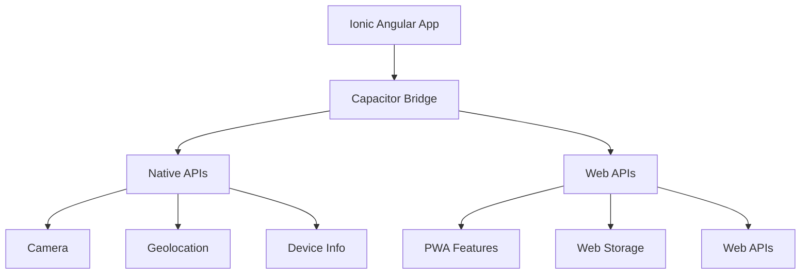
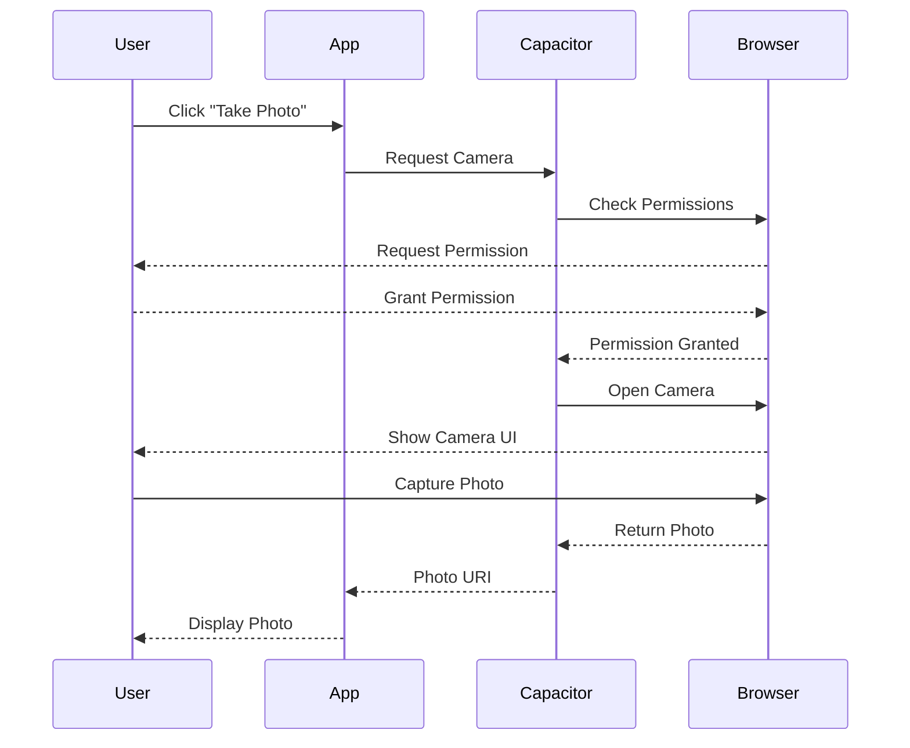
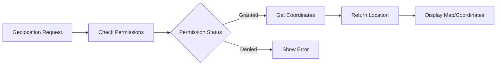
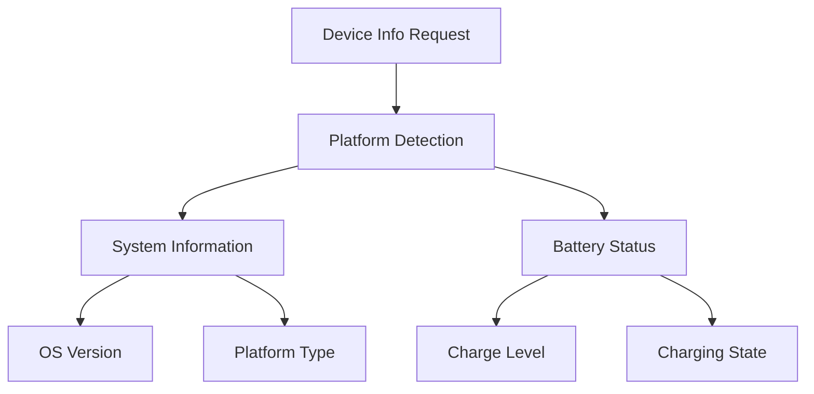

# Ionic Angular Capacitor Lab: Building a Travel Companion App

## Overview

Capacitor is Ionic's official native runtime that makes it easy to build web applications that run natively on iOS, Android, and the web. Think of it as a bridge that connects your web application to native platform capabilities. For example, when you want to take a picture in your app, Capacitor allows your web code to communicate with the device's native camera functionality.

In this lab, we'll build a Travel Companion app that demonstrates three key Capacitor features:
1. Camera access for taking travel photos
2. Geolocation for tracking your location
3. Device information for platform-specific features

**Prerequisites:**
- Basic knowledge of Angular and TypeScript
- Ionic framework fundamentals
- Node.js and npm installed
- Visual Studio Code or similar IDE

## Agenda

1. [Project Setup and Capacitor Configuration](#1-project-setup-and-capacitor-configuration)
2. [Camera Integration](#2-camera-integration)
3. [Geolocation Implementation](#3-geolocation-implementation)
4. [Device Information](#4-device-information)
5. [Final Integration](#5-final-integration)

## 1. Project Setup and Capacitor Configuration

### Understanding Capacitor

Capacitor serves as a bridge between your web application and native platform features. Here's how it works:



When running in a browser:
- Capacitor uses web APIs where available (like the Web Geolocation API)
- For native-only features, it provides graceful fallbacks or mock implementations
- This allows us to develop and test most features directly in the browser

### Project Creation and Setup

1. First, let's create a new Ionic project with the blank template:
   ```bash
   # Create new Ionic standalone project
   ionic start travel-companion blank --type=angular --standalone

   # Navigate to project directory
   cd travel-companion
   ```

2. Install Capacitor Plugins:
   ```bash
   npm install @capacitor/camera @capacitor/geolocation @capacitor/device
   ```

   Each plugin provides a specific native capability:
   - @capacitor/camera: Provides access to the device's camera
   - @capacitor/geolocation: Enables access to location services
   - @capacitor/device: Gives information about the device

3. Configure Capacitor:
   The `capacitor.config.ts` file tells Capacitor how to handle permissions and platform-specific settings:

```typescript
// capacitor.config.ts
import { CapacitorConfig } from '@capacitor/cli';

const config: CapacitorConfig = {
  appId: 'io.ionic.travelcompanion',
  appName: 'Travel Companion',
  webDir: 'www',
  server: {
    androidScheme: 'https'
  },
  plugins: {
    Camera: {
      permissionType: 'camera'
    },
    Geolocation: {
      permissionType: 'geolocation'
    }
  }
};

export default config;
```

Key points about the configuration:
- `appId`: A unique identifier for your app (similar to a package name)
- `webDir`: Where your built web assets are located
- `plugins`: Configuration for specific Capacitor plugins

## 2. Camera Integration

### Understanding Capacitor Camera Plugin

The Camera plugin provides a consistent interface to capture photos across different platforms. When running in the browser, it uses the device's webcam through the Web Camera API.



### Camera Service Implementation

Let's create a service to handle camera operations:

```typescript
// src/app/services/camera.service.ts
import { Injectable } from '@angular/core';
import { Camera, CameraResultType, CameraSource } from '@capacitor/camera';

@Injectable({
  providedIn: 'root'
})
export class CameraService {
  constructor() { }

  async takePicture() {
    try {
      const image = await Camera.getPhoto({
        quality: 90,
        allowEditing: false,
        resultType: CameraResultType.Uri,
        source: CameraSource.Camera
      });
      
      return image.webPath;
    } catch (error) {
      console.error('Error taking photo:', error);
      throw error;
    }
  }
}
```

Key points about the Camera service:
- `CameraResultType.Uri`: Returns a web-friendly URL to the photo
- `quality`: Adjusts the image quality (1-100)
- `allowEditing`: Enables/disables photo editing before saving
- `source`: Specifies whether to use camera or photo library

### Browser Testing Note
When testing in the browser:
- The camera plugin will use your computer's webcam
- A browser permission prompt will appear for camera access
- Photos will be stored temporarily in browser memory

## 3. Geolocation Implementation

### Understanding Capacitor Geolocation

The Geolocation plugin provides access to location services across platforms. In the browser, it uses the Web Geolocation API.



### Location Service Implementation

```typescript
// src/app/services/location.service.ts
import { Injectable } from '@angular/core';
import { Geolocation, Position } from '@capacitor/geolocation';

@Injectable({
  providedIn: 'root'
})
export class LocationService {
  constructor() { }

  async getCurrentPosition(): Promise<Position> {
    try {
      // Request permissions first
      await this.requestPermissions();
      
      // Get current position
      const coordinates = await Geolocation.getCurrentPosition();
      return coordinates;
    } catch (error) {
      console.error('Error getting location:', error);
      throw error;
    }
  }

  async requestPermissions() {
    return await Geolocation.requestPermissions();
  }
}
```

Key points about Geolocation:
- Always request permissions before accessing location
- Returns latitude, longitude, and accuracy
- Browser testing uses the Web Geolocation API
- Location accuracy may vary in browser testing

### Browser Testing Note
When testing geolocation in the browser:
- You'll see a browser permission prompt for location access
- Location data comes from your computer's location services
- Accuracy might be less precise than on mobile devices

## 4. Device Information

### Understanding Device Information Plugin

The Device plugin provides information about the device your app is running on. This is particularly useful for platform-specific customization.



### Device Service Implementation

```typescript
// src/app/services/device-info.service.ts
import { Injectable } from '@angular/core';
import { Device } from '@capacitor/device';

@Injectable({
  providedIn: 'root'
})
export class DeviceInfoService {
  constructor() { }

  async getDeviceInfo() {
    try {
      const info = await Device.getInfo();
      const battery = await Device.getBatteryInfo();
      return { ...info, battery };
    } catch (error) {
      console.error('Error getting device info:', error);
      throw error;
    }
  }
}
```

Key information provided:
- Platform (web, ios, android)
- Operating system version
- Battery status and level
- Memory usage
- Screen size and orientation

### Browser Testing Note
When testing device information in the browser:
- Platform will be reported as 'web'
- Some device-specific information may be limited
- Battery information depends on browser support

## 5. Final Integration

Now let's bring everything together in our main page:

```typescript
// src/app/home/home.page.ts
import { Component } from '@angular/core';
import { IonicModule } from '@ionic/angular';
import { PhotoCaptureComponent } from '../components/photo-capture/photo-capture.component';
import { LocationDisplayComponent } from '../components/location-display/location-display.component';
import { DeviceInfoComponent } from '../components/device-info/device-info.component';

@Component({
  selector: 'app-home',
  standalone: true,
  imports: [
    IonicModule,
    PhotoCaptureComponent,
    LocationDisplayComponent,
    DeviceInfoComponent
  ],
  template: `
    <ion-header>
      <ion-toolbar>
        <ion-title>Travel Companion</ion-title>
      </ion-toolbar>
    </ion-header>

    <ion-content>
      <app-photo-capture></app-photo-capture>
      <app-location-display></app-location-display>
      <app-device-info></app-device-info>
    </ion-content>
  `
})
export class HomePage {}
```

## Browser Testing Instructions

To test your app:

1. Start the development server:
   ```bash
   ionic serve
   ```

2. When testing features:
   - Camera: Allow browser access to your webcam when prompted
   - Location: Allow browser access to your location when prompted
   - Device Info: View basic web platform information

3. Testing Tips:
   - Use Chrome DevTools' device emulation for mobile testing
   - Test on different browsers to ensure compatibility
   - Use the browser's developer tools to monitor network requests and errors

## DIY Tasks

1. Photo Gallery Enhancement:
   - Modify the Camera service to store multiple photos
   - Create a gallery view to display all captured photos
   - Add the ability to delete photos

2. Location Features:
   - Add a display for the current address using reverse geocoding
   - Show location accuracy information
   - Add a refresh button for location updates

3. Device Information Display:
   - Create a detailed device information page
   - Add battery level monitoring
   - Display network connection status

## Common Issues and Solutions

1. Camera Not Working:
   - Ensure webcam is connected and functioning
   - Check browser permissions
   - Try a different browser

2. Location Errors:
   - Enable location services in your system
   - Clear browser permissions and try again
   - Check if you're using HTTPS (required for geolocation)

3. Device Info Limited:
   - Some information may be unavailable in browser
   - Check browser compatibility
   - Use feature detection before accessing properties

## Additional Resources

- [Capacitor Documentation](https://capacitorjs.com/docs)
- [Ionic Angular Documentation](https://ionicframework.com/docs/angular/overview)
- [Web APIs on MDN](https://developer.mozilla.org/en-US/docs/Web/API)

## Submission Requirements

1. Working application with all basic features:
   - Camera capture
   - Location display
   - Device information
2. Screenshots of each feature working in the browser
3. Brief write-up explaining:
   - How Capacitor helps in building cross-platform apps
   - Challenges encountered and solutions
   - Browser-specific limitations you discovered
4. (Optional) Implemented bonus features with documentation

---
End of Lab
