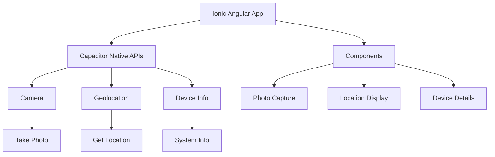
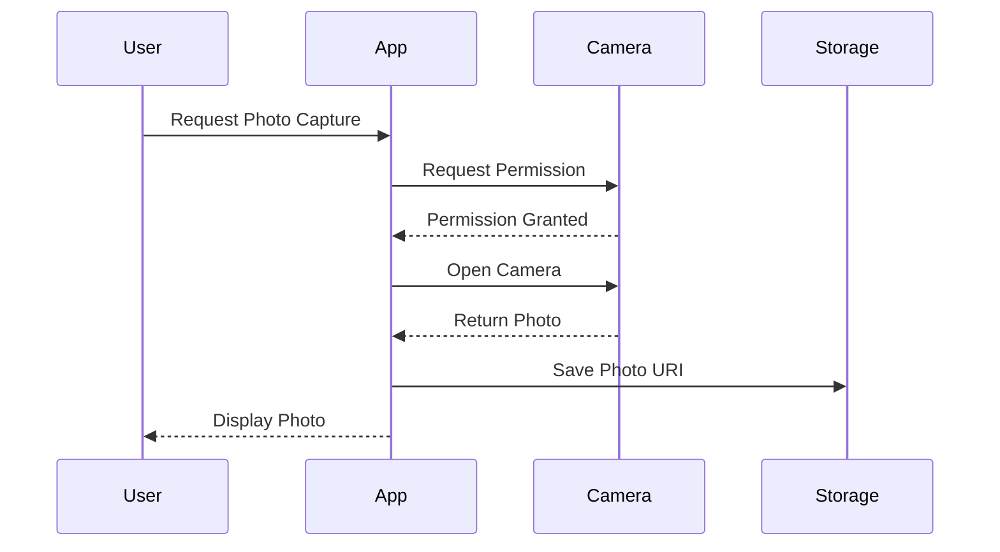
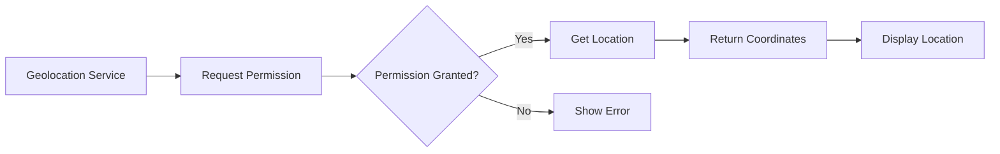
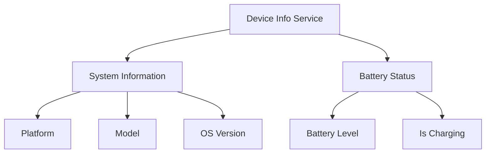

# Ionic Angular Capacitor Lab: Building a Travel Companion App

## Agenda

1. [Project Setup and Capacitor Configuration](#1-project-setup-and-capacitor-configuration)
2. [Camera Integration](#2-camera-integration)
3. [Geolocation Implementation](#3-geolocation-implementation)
4. [Device Information](#4-device-information)
5. [Final Integration](#5-final-integration)

## 1. Project Setup and Capacitor Configuration

### Concept Introduction: Project Architecture

The lab demonstrates building a Travel Companion application using Ionic Angular with Capacitor native features. The architecture combines Camera, Geolocation, and Device APIs to create a comprehensive mobile experience.



### Procedure

1. Create New Project:
   ```bash
   # Create new Ionic standalone project
   ionic start travel-companion blank --type=angular --standalone

   # Navigate to project directory
   cd travel-companion

   # Install Capacitor plugins
   npm install @capacitor/camera @capacitor/geolocation @capacitor/device

   # Add platforms
   ionic cap add android
   ionic cap add ios
   ```

2. Configure Capacitor:
   - Update `capacitor.config.ts` with necessary permissions
   - Configure platform-specific settings

```typescript
// capacitor.config.ts
import { CapacitorConfig } from '@capacitor/cli';

const config: CapacitorConfig = {
  appId: 'io.ionic.travelcompanion',
  appName: 'Travel Companion',
  webDir: 'www',
  server: {
    androidScheme: 'https'
  },
  plugins: {
    Camera: {
      permissionType: 'camera'
    },
    Geolocation: {
      permissionType: 'geolocation'
    }
  }
};

export default config;
```

## 2. Camera Integration

### Concept Introduction: Camera Implementation



### Camera Service Implementation

```typescript
// src/app/services/camera.service.ts
import { Injectable } from '@angular/core';
import { Camera, CameraResultType, CameraSource } from '@capacitor/camera';

@Injectable({
  providedIn: 'root'
})
export class CameraService {
  constructor() { }

  async takePicture() {
    try {
      const image = await Camera.getPhoto({
        quality: 90,
        allowEditing: false,
        resultType: CameraResultType.Uri,
        source: CameraSource.Camera
      });
      
      return image.webPath;
    } catch (error) {
      console.error('Error taking photo:', error);
      throw error;
    }
  }
}
```

### Photo Capture Component Implementation

```typescript
// src/app/components/photo-capture/photo-capture.component.ts
import { Component } from '@angular/core';
import { CommonModule } from '@angular/common';
import { IonicModule } from '@ionic/angular';
import { CameraService } from '../../services/camera.service';

@Component({
  selector: 'app-photo-capture',
  standalone: true,
  imports: [CommonModule, IonicModule],
  template: `
    <ion-card>
      <ion-card-header>
        <ion-card-title>Travel Photo</ion-card-title>
      </ion-card-header>
      <ion-card-content>
        <ion-img *ngIf="photoUrl" [src]="photoUrl"></ion-img>
        <ion-button expand="block" (click)="capturePhoto()">
          Take Photo
        </ion-button>
      </ion-card-content>
    </ion-card>
  `
})
export class PhotoCaptureComponent {
  photoUrl: string | undefined;

  constructor(private cameraService: CameraService) {}

  async capturePhoto() {
    try {
      this.photoUrl = await this.cameraService.takePicture();
    } catch (error) {
      console.error('Error in component:', error);
    }
  }
}
```

## 3. Geolocation Implementation

### Concept Introduction: Location Services



### Location Service Implementation

```typescript
// src/app/services/location.service.ts
import { Injectable } from '@angular/core';
import { Geolocation, Position } from '@capacitor/geolocation';

@Injectable({
  providedIn: 'root'
})
export class LocationService {
  constructor() { }

  async getCurrentPosition(): Promise<Position> {
    try {
      const coordinates = await Geolocation.getCurrentPosition();
      return coordinates;
    } catch (error) {
      console.error('Error getting location:', error);
      throw error;
    }
  }

  async requestPermissions() {
    return await Geolocation.requestPermissions();
  }
}
```

## 4. Device Information

### Concept Introduction: Device Info Architecture



### Device Info Service Implementation

```typescript
// src/app/services/device-info.service.ts
import { Injectable } from '@angular/core';
import { Device } from '@capacitor/device';

@Injectable({
  providedIn: 'root'
})
export class DeviceInfoService {
  constructor() { }

  async getDeviceInfo() {
    try {
      const info = await Device.getInfo();
      const battery = await Device.getBatteryInfo();
      return { ...info, battery };
    } catch (error) {
      console.error('Error getting device info:', error);
      throw error;
    }
  }
}
```

## 5. Final Integration

### Main Page Integration

```typescript
// src/app/home/home.page.ts
import { Component } from '@angular/core';
import { IonicModule } from '@ionic/angular';
import { PhotoCaptureComponent } from '../components/photo-capture/photo-capture.component';
import { LocationDisplayComponent } from '../components/location-display/location-display.component';
import { DeviceInfoComponent } from '../components/device-info/device-info.component';

@Component({
  selector: 'app-home',
  standalone: true,
  imports: [
    IonicModule,
    PhotoCaptureComponent,
    LocationDisplayComponent,
    DeviceInfoComponent
  ],
  template: `
    <ion-header>
      <ion-toolbar>
        <ion-title>Travel Companion</ion-title>
      </ion-toolbar>
    </ion-header>

    <ion-content>
      <app-photo-capture></app-photo-capture>
      <app-location-display></app-location-display>
      <app-device-info></app-device-info>
    </ion-content>
  `
})
export class HomePage {}
```

### DIY Tasks

1. Add a photo gallery to store multiple captured images
2. Implement reverse geocoding to show address from coordinates
3. Add error handling and loading states
4. Create a share feature for captured photos

## Testing Instructions

1. Testing in Browser:
   ```bash
   ionic serve
   ```

2. Testing on Android:
   ```bash
   ionic cap sync
   ionic cap open android
   ```

3. Testing on iOS:
   ```bash
   ionic cap sync
   ionic cap open ios
   ```

## Troubleshooting Guide

Common issues and their solutions:

1. Camera Permissions
   - Check AndroidManifest.xml and Info.plist
   - Verify permissions are properly requested
   - Check camera privacy settings on device

2. Geolocation Errors
   - Enable location services on device
   - Check accuracy settings
   - Verify proper permissions in config

3. Device Info Issues
   - Ensure plugin is properly installed
   - Check platform support
   - Verify plugin initialization

## Additional Resources

- [Capacitor Documentation](https://capacitorjs.com/docs)
- [Ionic Angular Documentation](https://ionicframework.com/docs/angular/overview)
- [Angular Standalone Components](https://angular.io/guide/standalone-components)

## Submission Requirements

1. Working application with all features implemented
2. Screenshots of each feature working on a physical device or emulator
3. Brief writeup of challenges encountered and solutions implemented
4. (Optional) Implemented bonus features with documentation

---
End of Lab
