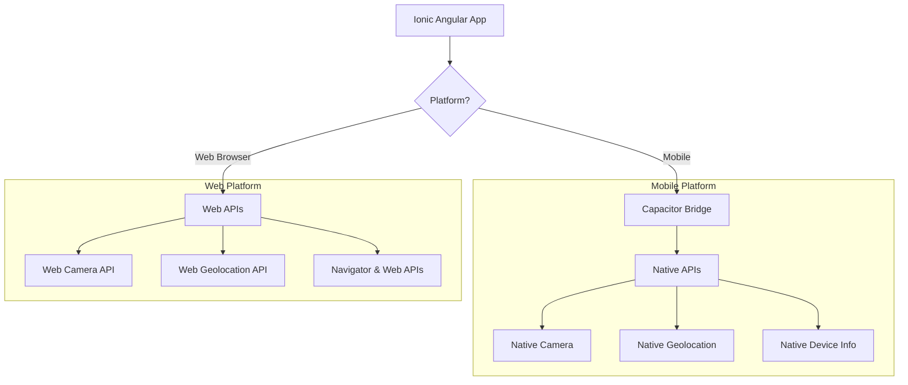
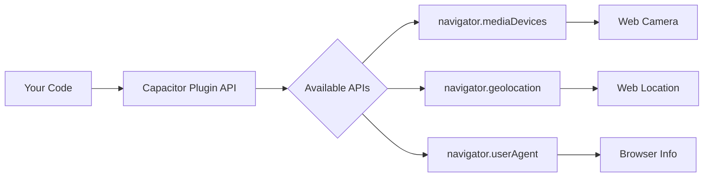
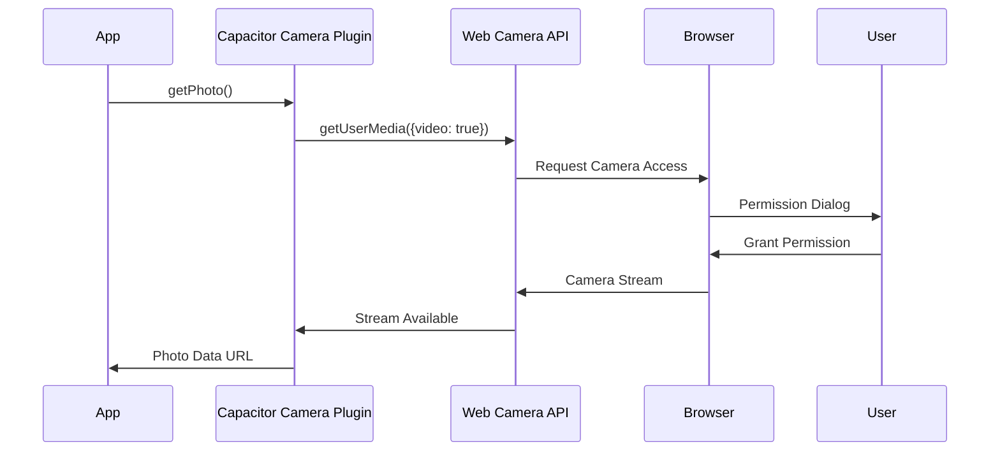
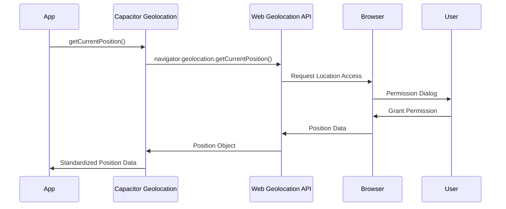
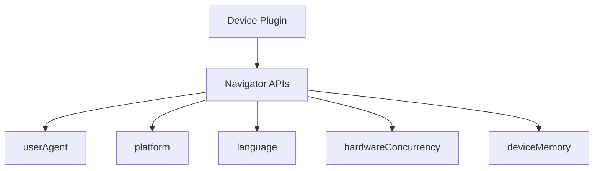

# Ionic Angular Capacitor Lab: Building a Travel Companion App

## Overview

[Capacitor](https://capacitorjs.com/) is Ionic's platform abstraction layer that enables web applications to access native functionality across different platforms. What makes it special is its intelligent handling of APIs:
- In a web browser, it uses Web APIs directly when available
- On mobile devices, it uses native platform APIs through a bridge
- Your code remains the same regardless of platform

In this lab, we'll build a Travel Companion app that demonstrates how Capacitor provides a consistent interface to different platform capabilities.

## Contents
1. [Project Setup and Understanding Web APIs](#1-project-setup-and-understanding-web-apis)
    - [Understanding How Capacitor Works in the Browser](#understanding-how-capacitor-works-in-the-browser)
    - [Project Creation and Setup](#project-creation-and-setup)
2. [Camera Implementation](#2-camera-implementation)
    - [Understanding the Web Camera API](#understanding-the-web-camera-api)
    - [Camera Service Implementation](#camera-service-implementation)
    - [What's Really Happening in the Browser](#whats-really-happening-in-the-browser)
3. [Geolocation Implementation](#3-geolocation-implementation)
    - [Understanding the Web Geolocation API](#understanding-the-web-geolocation-api)
    - [Location Service Implementation](#location-service-implementation)
    - [What's Really Happening in the Browser](#whats-really-happening-in-the-browser-1)
4. [Device Information](#4-device-information)
    - [Understanding Browser APIs for Device Info](#understanding-browser-apis-for-device-info)
    - [Device Service Implementation](#device-service-implementation)
    - [What's Really Happening in the Browser](#whats-really-happening-in-the-browser-2)
5. [Network Imformation](#5-network-information)
6. [Text to Speech](#6-text-to-speech)
7. [Browser Testing Guide](#7-browser-testing-guide)
    - [Setting Up for Browser Testing](#setting-up-for-browser-testing)
    - [Testing Each Feature](#testing-each-feature)
    - [Understanding Browser Limitations](#understanding-browser-limitations)
6. [DIY Tasks](#diy-tasks)
7. [Additional Resources](#additional-resources)
8. [Submission Requirements](#submission-requirements)



## 1. Project Setup and Understanding Web APIs

### Understanding How Capacitor Works in the Browser

When running in a browser, Capacitor provides a consistent interface to these Web APIs:



### Project Creation and Setup

1. Install the Official Ionic extension for VSCode
2. Create new Ionic project:
   ```bash
   # Create new Ionic Angular project
   ionic start travel-companion blank --type=angular

   # Select Standalone
   
   # Navigate to project directory
   cd travel-companion
   ```

3. Install Capacitor Plugins:
   ```bash
   npm install @ionic/pwa-elements @capacitor/camera @capacitor/geolocation @capacitor/device
   ```

   Each plugin provides a consistent interface to different platform capabilities:
   - @ionic/pwa-elements: This package provides web implementations for Capacitor plugins, allowing them to function in a web environment.
   - @capacitor/camera: Uses navigator.mediaDevices.getUserMedia() in browser
   - @capacitor/geolocation: Uses navigator.geolocation in browser
   - @capacitor/device: Uses various navigator properties in browser

4. Understanding Browser APIs:
   Before we implement the plugins, let's look at the Web APIs we'll be using:

   ```typescript
   // Web Camera API
   const stream = await navigator.mediaDevices.getUserMedia({
     video: true
   });

   // Web Geolocation API
   navigator.geolocation.getCurrentPosition((position) => {
     const { latitude, longitude } = position.coords;
   });

   // Browser Information
   const userAgent = navigator.userAgent;
   const platform = navigator.platform;
   ```

## 2. Camera Implementation

### Understanding the Web Camera API

When using Capacitor's Camera plugin in the browser, it interfaces with the Web Camera API (navigator.mediaDevices).



First create a new services folder with a new camera service inside:
```bash
ionic g s services/camera
```

### Camera Service Implementation

```typescript
// src/app/services/camera.service.ts
import { Injectable } from '@angular/core';
// Import Capacitor Camera plugin and its types
import { Camera, CameraResultType } from '@capacitor/camera';

// Injectable decorator marks this as a service that can be dependency injected
@Injectable({
  providedIn: 'root'  // Service is provided at the root level, creating a singleton instance
})
export class CameraService {
  /**
   * Takes a picture using the device's camera
   * @returns Promise<string | undefined> Returns base64 encoded image string or undefined if failed
   */
  async takePicture(): Promise<string | undefined> {
    // Use Capacitor Camera API to capture photo
    const image = await Camera.getPhoto({
      // Request base64 format for easy display in HTML img tag
      resultType: CameraResultType.Base64,
      // Set image quality (0-100)
      quality: 90
    });

    // Convert base64 string to data URL format for img src attribute
    // Returns undefined if no image was captured
    return image.base64String 
      ? `data:image/jpeg;base64,${image.base64String}` 
      : undefined;
  }
}
```
Create a button on the home page template to active the `takePicture()` method above.

### What's Really Happening in the Browser
1. The Camera.getPhoto() call triggers:
   - Request to navigator.mediaDevices.getUserMedia()
   - Browser's permission prompt
   - Creation of a video stream
2. Capacitor handles:
   - Converting the video stream to a photo
   - Providing a consistent return format

## 3. Geolocation Implementation

### Understanding the Web Geolocation API

In the browser, Capacitor's Geolocation plugin uses the Web Geolocation API directly.



Create a new localtion service :
```bash
ionic g s services/location
```
Turn on Locations services in Windows. Search for Location and turn on the switch. 

Go to [Capacitor Plugins Webpage](https://capacitorjs.com/docs/plugins) to assist with writing the following service.

### Location Service Implementation

```typescript
// src/app/services/location.service.ts
import { Injectable } from '@angular/core';
import { Geolocation } from '@capacitor/geolocation';

@Injectable({
  providedIn: 'root'
})
export class LocationService {
  constructor() { }

  async getCurrentPosition() {
    // YOUR CODE HERE
  }
}
```

### What's Really Happening in the Browser
1. Geolocation.getCurrentPosition() maps to:
   - navigator.geolocation.getCurrentPosition()
   - Browser's location permission prompt
2. The returned position object includes:
   - latitude and longitude
   - accuracy information
   - timestamp

## 4. Device Information

### Understanding Browser APIs for Device Info

The Device plugin uses various browser APIs to gather system information.



Create a new device-info service :
```bash
ionic g s services/device-info
```
Go to [Capacitor Plugins Webpage](https://capacitorjs.com/docs/plugins) to assist with writing the following service.

### Device Service Implementation

```typescript
// src/app/services/device-info.service.ts
import { Injectable } from '@angular/core';
import { Device } from '@capacitor/device';

@Injectable({
  providedIn: 'root'
})
export class DeviceInfoService {
  constructor() { }

  async getDeviceInfo() {
    // YOUR CODE HERE
  }
}
```

### What's Really Happening in the Browser
1. Device.getInfo() collects information from:
   - navigator.userAgent
   - navigator.platform
   - window.innerWidth/Height
   - Other browser APIs
2. Information available in browser is limited compared to mobile

## 5. Network Information

Go to [Capacitor Plugins Webpage](https://capacitorjs.com/docs/plugins) to assist with incorporating this plugin.

## 6. Text to Speech

Go to [Capacitor Plugins Webpage](https://capacitorjs.com/docs/plugins) to assist with incorporating this plugin. Please note this is a `Community Plugin`.

## 7. Browser Testing Guide

### Setting Up for Browser Testing

1. Start the development server:
   ```bash
   ionic serve
   ```

2. Open Browser Developer Tools:
   - Chrome DevTools (F12 or Ctrl+Shift+I)
   - Navigate to Network tab to monitor API calls
   - Use Console tab to view logs

### Testing Each Feature

1. Camera Testing:
   ```typescript
   // You can monitor the actual Web API call:
   navigator.mediaDevices.addEventListener('devicechange', () => {
     console.log('Camera devices changed');
   });
   ```

2. Geolocation Testing:
   ```typescript
   // Monitor actual position updates:
   navigator.geolocation.watchPosition((position) => {
     console.log('New position:', position);
   });
   ```

3. Device Info Testing:
   ```typescript
   // Log available browser information:
   console.log({
     userAgent: navigator.userAgent,
     platform: navigator.platform,
     language: navigator.language
   });
   ```

### Understanding Browser Limitations

1. Camera Limitations:
   - Requires HTTPS in modern browsers
   - Limited to available webcam devices
   - No flash control in browser

2. Geolocation Limitations:
   - Accuracy may be lower than mobile
   - May use IP-based fallback
   - Requires HTTPS

3. Device Info Limitations:
   - Limited hardware information
   - No battery information in some browsers
   - Platform always returns 'web'

## DIY Tasks

1. Enhanced Camera Features:
   - Create a photo gallery with IndexedDB storage

2. Advanced Geolocation:
   - Implement position watching
   - Calculate distance between points
   - Show accuracy circles on a map

3. Browser Detection:
   - Create a browser compatibility checker
   - Implement feature detection
   - Show available Web APIs

## Additional Resources

- [Web Camera API Documentation](https://developer.mozilla.org/en-US/docs/Web/API/MediaDevices/getUserMedia)
- [Geolocation API Documentation](https://developer.mozilla.org/en-US/docs/Web/API/Geolocation_API)
- [Browser APIs Documentation](https://developer.mozilla.org/en-US/docs/Web/API)

## Submission Requirements

1. Working application demonstrating:
   - Web Camera API integration
   - Geolocation API usage
   - Browser information display
2. Browser testing documentation:
   - Screenshots of permission prompts
   - Network tab showing API calls
   - Console logs of Web API interactions
---
End of Lab
